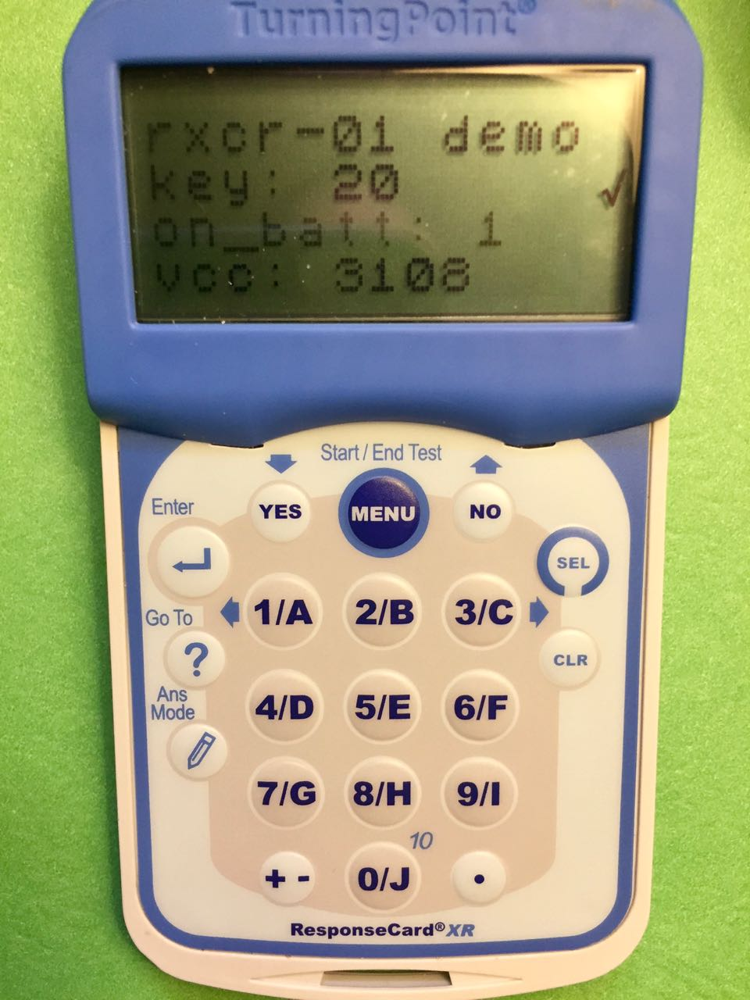
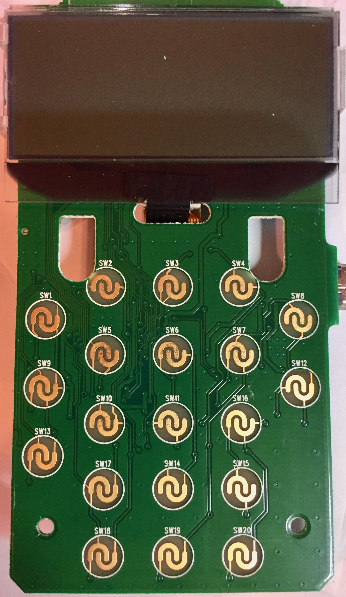
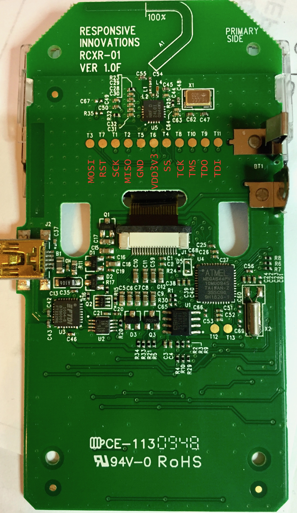

# rcxr01
Various documentation and example code for Turning Technologies ResponseCard XR model RCXR-01

inspired by [Travis Goodspeed's most excellent reverse engineering](http://travisgoodspeed.blogspot.com/2010/07/reversing-rf-clicker.html) of older versions of these clickers.
The RCXR-01 seems to be quite handy as a portable NRF24 platform (i.e. handheld control/monitoring). I hope that you will find lots of nice hacks

This is not about reverse engineering the existing software, but rather reusing the hardware completely. You get a nice lcd, matrix keypad, NRF24 radio, usb-uart, and mcu with plenty of flash that can run Arduino (or not if that's your thing ;).

## hardware
* ATmega 644PV mcu
 * 64k flash, 4k ram, 2k eeprom
 * internal RC 1MHz clock (CKDIV8 fuse set)
 * 32khz crystal on TOSC1/2 (timer2 can be setup as rtc)
* NRF24L01 radio
 * on hardware spi bus (SCK/MISO/MOSI)
 * CE -> PB0, CSN -> PC1
* CAT25128 16KB SPI EEPROM
 * CS -> SS (PB4)
 * doesn't look like TT used the external eeprom for anything.
* FTDI FT232R usb to uart
 * TXD/RXD seem to be connected through some isolator? to mcu
 * has custom PID: 0xdb14
  * flashing to default ftdi PID: `sudo ./ft232r_prog --old-pid 0xdb14 --new-pid 0x6001` so serial port is setup on connect
 * DTR/RTS not connected. May want to connect either these to mcu RST (top pad of D5) w/ in-line 1uF cap for auto-reset, i.e. for arduino bootloader
* when usb power is present, PB2 is pulled low (via Q3)
* testpoint pads under battery compartment (from left to right)
 * MOSI, RST, SCK, MISO, GND, VDD3v3, SS, TCK, TMS, TDO, TDI
* LCD panel
 * 128x32 matrix plus several custom symbols. Probably ST7565 chipset.  
 * U8x8 lib customized: U8X8_ST7565_RCXR01_4W_HW_SPI
 * mcu connectivity: SPI for SCLK & SI. CS -> PD5, RST -> PD6, RS(A0) -> PB3

### keypad matrix map
|     |  PA5 |  PA2 |  PD3 |  PD4 |
| --- | ---- | ---- | ---- | ---- |
| PA1 |  SW1 |  SW2 |  SW3 |  SW4 |
| PA3 |  SW5 |  SW6 |  SW7 |  SW8 |
| PA6 |  SW9 | SW10 | SW11 | SW12 |
| PA7 | SW13 | SW14 | SW15 | SW16 |
| PA4 | SW17 | SW18 | SW19 | SW20 |

### intial fuses
 * (E:FE, H:9D, L:62)
 * http://eleccelerator.com/fusecalc/fusecalc.php?chip=atmega644p&LOW=62&HIGH=9D&EXTENDED=FE&LOCKBIT=FF

### flashing arduino bootloader
 * use something like usbasp, ftdi, etc. Cheap usbasp adapter worked fine for me.
 * https://github.com/MCUdude/MightyCore/tree/master/avr/bootloaders/optiboot_flash/atmega644p
  * use `optiboot_flash_atmega644p_9600_1000000L.hex` (tried running 8Mhz@38400, but uploading was not stable for me, at least on initial attempts.)
   * set fuses: `avrdude -v -p atmega644p -c usbasp -P usb -e -U lock:w:0x3f:m -U efuse:w:0xfd:m -U hfuse:w:0xd6:m -U lfuse:w:0x62:m`
   * flash bootloader: `avrdude -v -p atmega644p -c usbasp -P usb -U flash:w:optiboot_flash_atmega644p_9600_1000000L.hex:i -U lock:w:0x0f:m`
   * now should be able to use arduino bootloader at 9600 for uploading - yes it's a bit slow right now. (see note above about connecting RTS/DTR to RST for auto-reset.)
   * TODO: investigate stability of IntRC 8MHz@19200 bootloader
   
## building
 * using MightyCore board support for Arduino framework
 * using platformio for build/upload
 * pinouts and pin number mappings: https://github.com/MCUdude/MightyCore#pinout

## images
### pcb front

### pcb rear

